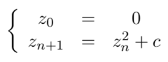

# mandelbrot-fractal

Une figure fractale est un objet mathématique, telle une courbe ou une surface, qui présente une structure similaire à toutes les échelles.
L'adjectif « fractal », à partir duquel l'usage a imposé le substantif une fractale pour désigner une figure ou une équation de géométrie fractale, est un néologisme créé par Benoît Mandelbrot en 1975 à partir de la racine latine fractus, qui signifie « brisé », « irrégulier », et de la désinence présente dans les adjectifs naval et banal (pluriels : navals, banals, fractals).
Les fractales sont partout : arbres, Poumons,Chou broccoli Romanesco, Fractale pouvant être obtenue comme un “système de Lindenmayer”. ...
 
En mathématiques, l'ensemble de Mandelbrot est une fractale définie comme l'ensemble des points c du plan complexe pour lesquels la suite de nombres complexes définie par récurrence par :
 
ne diverge pas quand n  →  ∞.
	Il a  été démontré que :
	-  Si il existe n tel que |Zn| > 2, la suite diverge ;
	-  L’ensemble de Mandelbrot est inclus dans 
{ c = a + ib  avec  −2,5 ≤ a ≤ 1,5   et   −1,5 ≤ b ≤ 1,5 } 

Pour C donné, c’est à dire pour a et b donné,  écrire une fonction dépendant de a et b qui permet de placer le point c = a + ib si la suite (Zn) ne diverge pas (on se contentera de calculer les 30 premiers termes de (Zn) pour vérifier expérimentalement si elle semble diverger ou non).
Il est plus facile de définir l’ensemble de Mandelbrot M ⊂ C par son complémentaire :
 
Donc l'ensemble des valeurs c ∈ C pour lesquels la suite des modules de (Zn) ne tend pas vers l’infini est l’ensemble de Mandelbrot.
